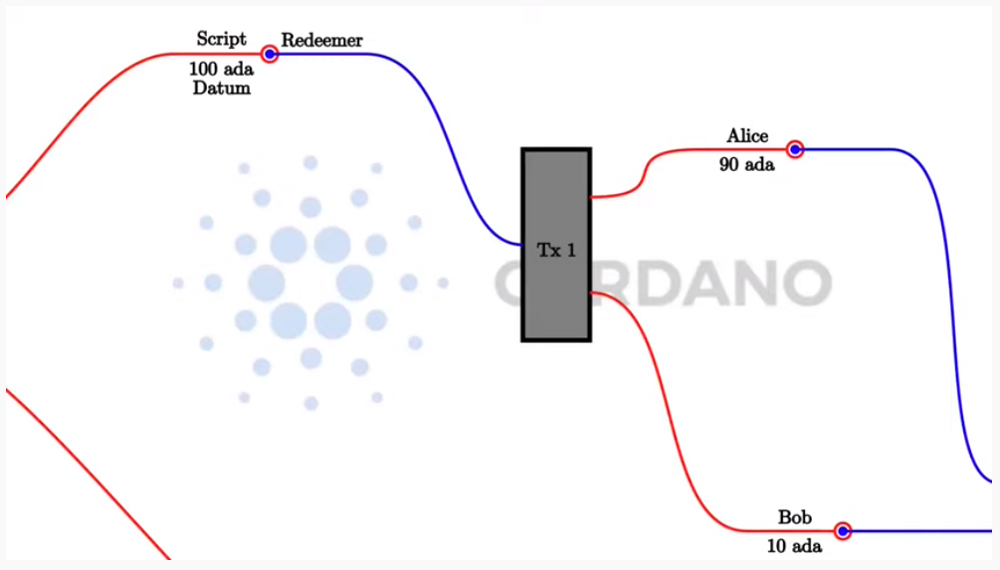
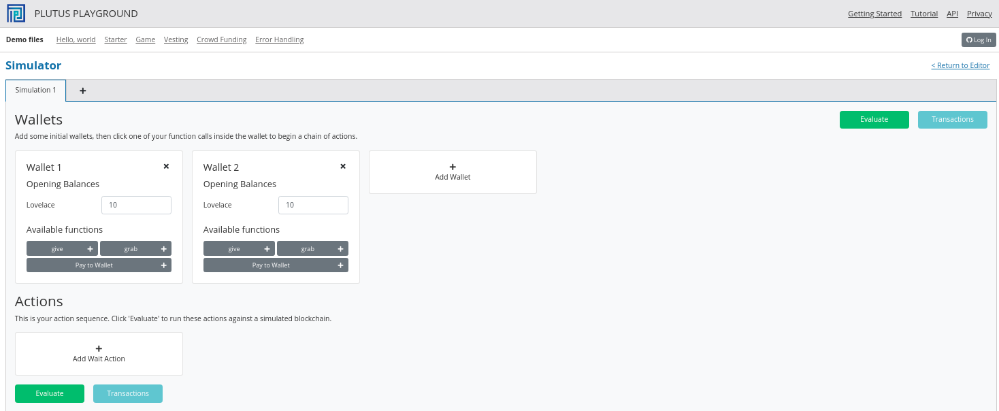
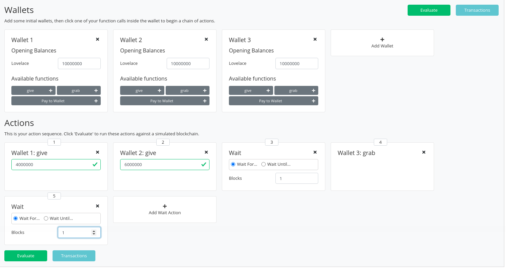
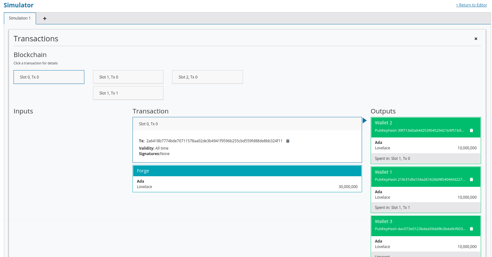
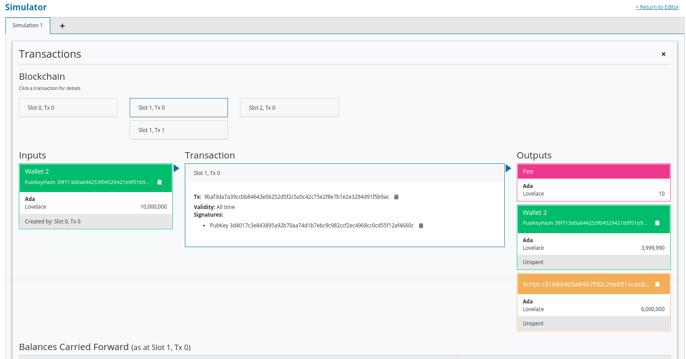
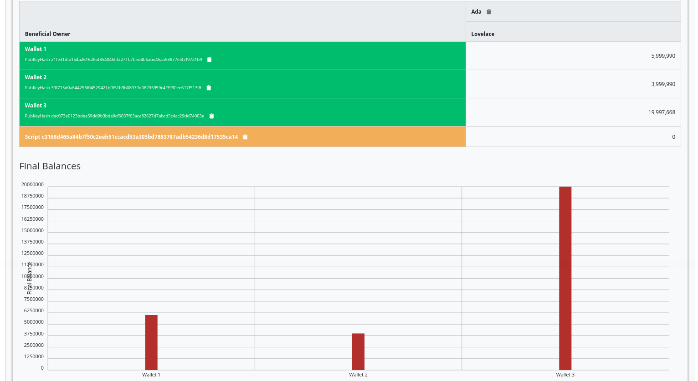
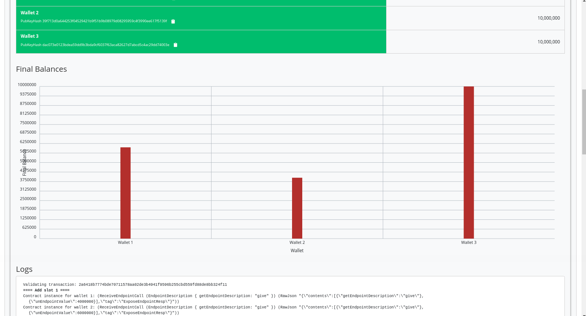
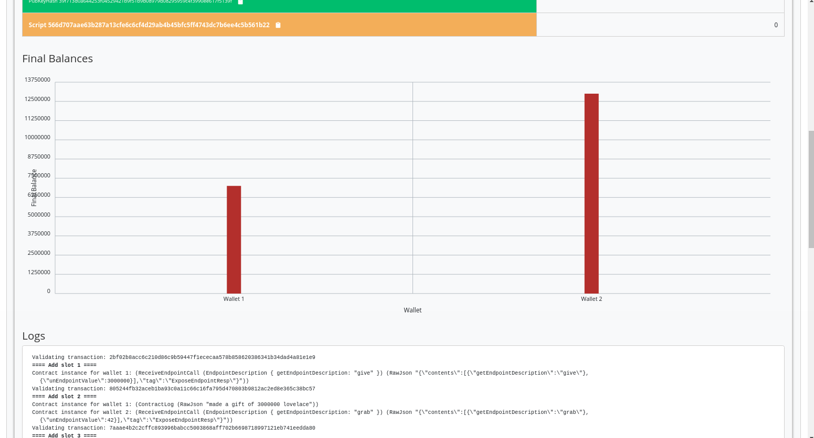

Week 02 - Validation
====================

.. note::
      Đây là tài liệu  `Bài giảng #2, Dr. Lars <https://youtu.be/7nDGZkUIeUQ>`__.

     Nó bao gồm mức thấp và mức cao tập lệnh xác thực on-chain.

      Mã trong bài giảng này sử dụng cam kết Plutus 81ba78edb1d634a13371397d8c8b19829345ce0d      

Trước khi bắt đầu
---------------

Hãy nói về một điểm quan trọng được đưa ra bởi một trong những người tiên phong sau bài giảng số 1.

Bạn sẽ gọi lại trong ví dụ đấu giá, chúng tôi tạo ra ba endpoints - ``start``, ``bid`` và ``close``. ``close`` có hai kịch bản. Nếu có giá thầu đủ cao, mã thông báo sẽ được chuyển đến người đặt giá thầu cao nhất. Nếu không có giá thầu đủ cao, mã thông báo sẽ quay trở lại người bán.

Điều gì sẽ xảy ra nếu ``endpoint close``  không có ở đó? Tiền có thể bị khóa mãi mãi trong hợp đồng không?

Đây là một điểm thực sự quan trọng, bởi vì những gì bạn phải nhận ra là UTxO trên blockchain chỉ là dữ liệu, chúng hoàn toàn thụ động. Để bất cứ điều gì xảy ra phải có một giao dịch. Để đạt được tiến bộ và thay đổi trạng thái của blockchain, phải có một giao dịch mới được gửi sử dụng các UTxO khác nhau và tạo ra các UTxO mới.

Chỉ có các giao dịch mới thay đổi trạng thái. UTxO sẽ không bao giờ tự hoạt động và thực hiện điều gì đó. Bạn không thể có một hợp đồng thông minh nằm trên blockchain và vào một thời điểm nào đó, đột nhiên thực hiện một hành động.

Vì vậy, chúng tôi thực sự cần ``endpoint close`` nếu chúng tôi muốn cuộc đấu giá được giải quyết. Trong trường hợp của chúng tôi, điểm cuối được kích hoạt theo cách thủ công. Bạn có thể viết một hợp đồng chạy trong ví sẽ tự động tạo closegiao dịch - có thể viết mã ngoài chuỗi khá phức tạp.

Tuy nhiên, theo quan điểm của blockchain, nó luôn là một yếu tố kích hoạt bên ngoài thực hiện điều gì đó. Không có gì xảy ra nếu nó không được kích hoạt từ bên ngoài.

Vì vậy, nếu không có ``endpoint close`` , hoặc ``endpoint close``  không bao giờ được kích hoạt, thì tiền sẽ vẫn nằm ở địa chỉ tập lệnh mãi mãi.

Giới thiệu
------------

Trong bài giảng đầu tiên, chúng ta đã thấy rằng hợp đồng thông minh có hai mặt - một phần trong chuỗi và một phần ngoài chuỗi.

Phần on-chain là về xác nhận. Nó cho phép các nút xác thực một giao dịch nhất định và liệu nó có được phép sử dụng một UTxO nhất định hay không.

Phần off-chain nằm trong ví của người dùng. Nó xây dựng và gửi các giao dịch phù hợp.

Cả hai đều là chủ đề quan trọng. Chúng tôi phải thành thạo cả hai để viết hợp đồng thông minh, nhưng hiện tại chúng tôi sẽ tập trung vào phần on-chain.

Hãy nhớ lại mô hình UTxO mở rộng mà ý tưởng là chúng tôi giới thiệu một loại địa chỉ mới.

Trong mô hình UTxO đơn giản, cái gọi là địa chỉ khóa công khai, trong đó địa chỉ được cung cấp bởi hàm băm của khóa công khai. Nếu một UTxO nằm ở địa chỉ khóa công khai như vậy, thì một giao dịch có thể sử dụng UTxO đó làm đầu vào nếu chữ ký thuộc khóa công khai đó được bao gồm trong giao dịch.

Những gì mô hình (E) UTxO làm là mở rộng điều này bằng cách thêm các địa chỉ tập lệnh có thể chạy logic tùy ý.

Khi một giao dịch muốn sử dụng UTxO ở một địa chỉ tập lệnh được xác thực bởi một nút, thì nút đó sẽ chạy tập lệnh và sau đó, tùy thuộc vào kết quả của tập lệnh, quyết định xem giao dịch có hợp lệ hay không.

Và nhớ lại rằng hai là ba bổ sung nữa:

Thay vì chỉ có chữ ký trên các giao dịch, chúng tôi có cái gọi là Người nhận thừa - các phần dữ liệu tùy ý.
Ở phía đầu ra UTxO, chúng tôi có một phần dữ liệu tùy ý bổ sung được gọi là Datum, bạn có thể coi đây là một phần nhỏ của trạng thái nằm trên UTxO.
Cuối cùng, chúng ta có bối cảnh. Có nhiều lựa chọn khác nhau về bối cảnh này có thể là gì. Nó có thể rất hạn chế, chỉ bao gồm Chúa cứu thế (như trong Bitcoin) hoặc rất toàn cầu, bao gồm toàn bộ trạng thái của blockchain (như trong Ethereum). Trong Cardano, đó là giao dịch đang được xác thực, bao gồm tất cả các đầu vào và đầu ra của nó.

Vì vậy, có ba phần dữ liệu mà một tập lệnh Plutus nhận được. Datum, đặt tại UTxO, người mua lại, đến từ đầu vào và xác thực, và ngữ cảnh, bao gồm giao dịch đang được xác thực và các đầu vào và đầu ra của nó.

Trong một triển khai cụ thể như Plutus, những phần thông tin này cần được biểu diễn bằng một kiểu dữ liệu cụ thể - kiểu dữ liệu Haskell. Khi nó xảy ra, lựa chọn đã được thực hiện để sử dụng cùng một kiểu dữ liệu cho cả ba người trong số họ. Ít nhất là ở mức độ thực hiện thấp.

Chúng ta sẽ xem xét điều đó đầu tiên, nhưng trong cuộc sống thực không ai thực sự sử dụng phương pháp tiếp cận cấp thấp này. Có nhiều cách thuận tiện hơn để sử dụng các kiểu dữ liệu phù hợp hơn cho những việc này, và chúng ta sẽ đề cập đến vấn đề đó ở phần sau của bài giảng này.

PlutusTx.Data
-------------

Như đề cập, the datum, redeemer and context chia sẻ một kiểu dữ liệu. 

Kiểu dữ liệu đó được đống gói trong ``plutus-core``, trong mô-đul ``PlutusCore.Data``.

Nó đực gọi đơn giản là  ``Data``.

.. code:: haskell

      data Data =
           Constr Integer [Data]
         | Map [(Data, Data)]
         | List [Data]
         | I Integer
         | B BS.ByteString
         deriving stock (Show, Eq, Ord, Generic)
         deriving anyclass (NFData)

Nó có 5 hàm tạo.

-  ``Constr`` lấy một Số nguyên và, một cách đệ quy, một danh sách ``Data``
-  ``Map`` lấy một danh sách các cặp *Data*. Bạn có thể coi đây là một bảng tra cứu các cặp khóa-giá trị trong đó cả khóa và giá trị đều thuộc loại ``Data``
-  ``List`` lấy một danh sách ``Data``
-  ``I`` lấy một số nguyên duy nhất
-  ``B`` lấy một chuỗi Byte

Đối với những người quen thuộc với định dạng JSON, điều này rất giống. Các hàm tạo không hoàn toàn giống nhau, nhưng giống như JSON, bạn có thể biểu diễn số, chuỗi, danh sách dữ liệu và các cặp khóa-giá trị. Nó có thể đại diện cho dữ liệu tùy ý, điều này làm cho nó rất phù hợp với mục đích của chúng tôi.

Chúng ta cũng có thể khám phá loại này trong REPL.

Chạy phần sau từ kho lưu trữ chương trình tiên phong của plutus. Bạn có thể cần khởi động nix-shell từ kho lưu trữ Plutus trước khi thay đổi vào thư mục ``week02``.

::

      cd code/week02
      cabal repl

Từ REPL, chúng ta cần  import ``PlutusTx`` để chúng có quyền truy cập vào``Data`` . ``Data`` không được định nghĩa trong ``PlutusTx``, nhưng nó được tái xuất từ đó.

::

      import PlutusTx

chúng ta có thể thấy thông tin về ``Data``.

::

      :i Data

Điều này chung ta có thể nhận được một số thông tin về *Data*.

.. code:: haskell

      Prelude Week02.Burn> import PlutusTx
      Prelude PlutusTx Week02.Burn> :i Data
      type Data :: *
      data Data
        = Constr Integer [Data]
        | Map [(Data, Data)]
        | List [Data]
        | I Integer
        | B bytestring-0.10.12.0:Data.ByteString.Internal.ByteString
              -- Defined in ‘plutus-core-0.1.0.0:PlutusCore.Data’
      instance Eq Data
        -- Defined in ‘plutus-core-0.1.0.0:PlutusCore.Data’
      instance Ord Data
        -- Defined in ‘plutus-core-0.1.0.0:PlutusCore.Data’
      instance Show Data
        -- Defined in ‘plutus-core-0.1.0.0:PlutusCore.Data’
      instance IsData Data -- Defined in ‘PlutusTx.IsData.Class’
      
Bây giờ chúng ta có thể chơi với nó. Chúng ta có thể sử dụng hàm ``I`` tạo để tạo một giá trị của kiểu ``Data``.

.. code:: haskell

      Prelude PlutusTx.Data Week02.Burn> I 42
      I 42

Chúng ta có thể hỏi loại của nó và xác nhận rằng nó thực sự thuộc loại ``Data``:

.. code:: haskell

      Prelude PlutusTx.Data Week02.Burn> :t I 42
      I 42 :: Data

TCách dễ nhất để tạo một giá trị kiểu ``Data`` bằng cách sử dụng hàm ``B`` tạo là sử dụng Phần mở rộng GHC ``OverloadedStrings``. Điều này cho phép các chuỗi ký tự được sử dụng thay cho các kiểu dữ liệu giống chuỗi và trình biên dịch sẽ diễn giải chúng như kiểu dự định của chúng.

.. code:: haskell

      Prelude PlutusTx.Data Week02.Burn> :set -XOverloadedStrings
      Prelude PlutusTx.Data Week02.Burn> :t B "Haskell"
      B "Haskell" :: Data

Chúng ta cũng có thể sử dụng các hàm tạo phức tạp hơn, như ``Map`` and ``List``:

.. code:: haskell

      Prelude PlutusTx.Data Week02.Burn> :t Map [(I 42, B "Haskell"), (List [I 0], I 1000)]
      Map [(I 42, B "Haskell"), (List [I 0], I 1000)] :: Data

Plutus Validator
----------------

Bây giờ chúng tôi đã sẵn sàng triển khai trình xác thực đầu tiên của mình..

Ví dụ 1 - Hợp đồng Gift 
~~~~~~~~~~~~~~~~~~~~~~~~~~~~~

The Code
++++++++

Chúng tôi bắt đầu tập lệnh bằng cách sao chép, dán danh sách các phần mở rộng ngôn ngữ GHC, cộng với một số phần nhập phụ thuộc từ ví dụ mà chúng tôi đã sử dụng trong bài giảng trước.

.. code:: haskell

      {-# LANGUAGE DataKinds           #-}
      {-# LANGUAGE FlexibleContexts    #-}
      ...

      module Week02.Gift where

      import           Control.Monad       hiding (fmap)
      import           Data.Map            as Map
      ...
      import           Text.Printf         (printf)

Sau đó, chúng tôi viết trình xác nhận. Cuối cùng, trình xác thực sẽ là một tập lệnh, sống trên blockchain trong Plutus Core, là một ngôn ngữ cấp thấp hơn dựa trên phép tính lambda. Nhưng, chúng ta không cần phải viết Plutus Core. Chúng ta có thể viết Haskell và sau này chúng ta sẽ xem cách chúng ta chuyển đổi Haskell đó thành tập lệnh Plutus Core.

Vì vậy, chúng tôi viết một hàm Haskell đại diện cho trình xác thực của chúng tôi. Như chúng ta đã biết, trình xác thực là một tập lệnh có ba phần đầu vào - dữ liệu, trình đổi và ngữ cảnh, tương ứng, ở cấp thấp nhất được biểu thị bằng ``Data`` kiểu dữ liệu.

.. code:: haskell

      mkValidator :: Data -> Data -> Data -> ()

Hơi ngạc nhiên, kết quả của hàm là ``()``. Trong Haskell ``Unit`` kiểu, tương tự như ``void`` trong một số ngôn ngữ khác, như C hoặc C # hoặc Java - đó là kiểu không mang thông tin.

``Unit`` là một kiểu tích hợp sẵn trong Haskell và nó chỉ có một giá trị, được viết theo cùng một cách với chính kiểu đó, như chúng ta có thể thấy từ REPL.

.. code:: haskell

      Prelude Week02.Gift> ()
      ()
      Prelude Week02.Gift> :t ()
      () :: ()

Một hàm có kiểu trả về ``()`` là khá bất thường trong Haskell. Trong các ngôn ngữ chính thống hơn, việc các hàm hoặc thủ tục không trả về giá trị là điều khá phổ biến. Trong những tình huống này, các hàm chỉ quan trọng đối với các tác dụng phụ của chúng, chẳng hạn như hàm Java in nội dung nào đó ra bảng điều khiển.

Nhưng Haskell là một ngôn ngữ thuần túy. Nếu bạn muốn có tác dụng phụ, điều này sẽ được hiển thị bởi hệ thống loại. Ví dụ: nếu mkValidator thực hiện bất kỳ IO nào, nó sẽ có chữ ký kiểu:

.. code:: haskell

      mkValidator :: Data -> Data -> Data -> IO ()

Điều này sẽ chỉ ra một hàm thực hiện các tác dụng phụ IO nhưng không có giá trị trả về thú vị.

Nhưng, như chúng ta biết rằng ``mkValidator`` hàm thực không thực hiện tác dụng phụ và không trả về giá trị nào, thực sự không có gì hữu ích mà nó có thể làm được.

Tuy nhiên, có điều gì đó mà hàm có thể làm cũng như trả về ``()``, cụ thể là nó có thể ném ra một ngoại lệ hoặc có lỗi. Và đó là những gì Plutus sử dụng.

Ý tưởng là nếu ``mkValidatorhàm`` không gặp lỗi hoặc đưa ra một ngoại lệ, thì quá trình xác nhận sẽ thành công. Nếu nó xuất hiện một lỗi thì việc xác thực không thành công và giao dịch bị từ chối.

Hãy viết trình xác nhận đơn giản nhất mà chúng ta có thể.

.. code:: haskell

      mkValidator :: Data -> Data -> Data -> ()
      mkValidator _ _ _ = ()

Đối số đầu tiên là dữ liệu, đối số thứ hai là trình chuộc và đối số thứ ba là ngữ cảnh. Điều đơn giản nhất mà chúng ta có thể làm là hoàn toàn bỏ qua cả ba đối số và quay trở lại ngay lập tức ``()``.

Điều này có nghĩa là địa chỉ tập lệnh tương ứng với trình xác thực này không quan tâm đến dữ liệu, nó không quan tâm đến trình đổi và không quan tâm đến ngữ cảnh. Nó sẽ luôn thành công và điều này có nghĩa là bất kỳ giao dịch nào cũng có thể sử dụng tập lệnh tại địa chỉ này làm đầu vào. Không quan trọng dữ liệu nào tồn tại cho UTxO tại địa chỉ tập lệnh này, không quan trọng công cụ đổi quà nào được sử dụng cho giao dịch và giao dịch có cấu trúc nào không quan trọng.

Nếu bạn gửi bất kỳ khoản tiền nào đến địa chỉ tập lệnh này, bất kỳ ai cũng có thể nhận ngay.

Hàm này chưa phải là mã Plutus, nó chỉ là một hàm Haskell. Để biến nó thành một tập lệnh Plutus, chúng ta cần phải biên dịch nó.

Kết quả của quá trình biên dịch của chúng tôi sang Plutus sẽ thuộc loại ``Validator``. Bên dưới hàm trong ``Gift.hs``, chúng tôi thêm đoạn mã sau.

.. code:: haskell

      validator :: Validator
      validator = mkValidatorScript $$(PlutusTx.compile [|| mkValidator ||])

Các chức năng ``mkValidatorScript``  mang kiểu ``CompiledCode (Data -> Data -> Data -> ()) -> Validator``. Nhằm mục đích tạo kiểu này và biên dịch tập lệnh ``mkValidator`` bằng cách sử dụng một thứ gọi là Template Haskell.

Template Haskell là một tính năng nâng cao của Haskell giải quyết một vấn đề tương tự như các hệ thống macro trong các ngôn ngữ khác. Macro là thứ được mở rộng tại thời điểm biên dịch.

Vì vậy, với mã này

.. code:: haskell

      $$(PlutusTx.compile [|| mkValidator ||])

Chúng tôi đang yêu cầu trình biên dịch viết mã cho hàm ``validator``  tại thời điểm biên dịch dựa trên ``mkValidatorhàm`` của chúng ta , và sau đó tiến hành biên dịch bình thường.

Bạn không cần phải hiểu nhiều về Template Haskell để viết Plutus vì nó luôn luôn giống nhau. Khi bạn đã xem một vài ví dụ, bạn có thể ít nhiều chỉ cần sao chép và dán.

Mẫu Haskell hy vọng tất cả mã sẽ có sẵn trong Oxford Brackets - ``[| |]``.

Với các trình xác thực phức tạp hơn, bạn có thể sẽ dựa vào nhiều hàm trợ giúp và bạn không muốn phải thêm chúng vào trong Dấu ngoặc đơn Oxford. Để tránh điều này, có một điều chúng ta cần làm đối với ``mkValidator`` hàm và đó là làm cho nó có thể nhập được bằng cách thêm thông số ``INLINABLE``.

.. code:: haskell

      {-# INLINABLE mkValidator #-}
      mkValidator :: Data -> Data -> Data -> ()
      mkValidator _ _ _ = ()

Bạn sẽ thấy điều này thường xuyên trong các tập lệnh Plutus và nó thường là một dấu hiệu cho thấy một hàm được sử dụng trong một tập lệnh xác thực. Tất cả các chức năng mà trình xác nhận phụ thuộc phải có thể nhập được.

Hãy quay lại REPL và xem xét trình xác nhận.

.. code:: haskell

      :l src/Week02/Gift.hs
      Ok, one module loaded.
      Prelude PlutusTx Week02.Gift> import Ledger.Scripts
      Prelude PlutusTx Ledger.Scripts Week02.Gift> validator
      Validator { <script> }

Chúng tôi có thể yêu cầu thông tin về ``Validator``.

.. code:: haskell

      Prelude PlutusTx Ledger.Scripts Week02.Gift> :i Validator
      type Validator :: *
      newtype Validator = Validator {getValidator :: Script}
              -- Defined in ‘plutus-ledger-api-0.1.0.0:Plutus.V1.Ledger.Scripts’
      instance Eq Validator
        -- Defined in ‘plutus-ledger-api-0.1.0.0:Plutus.V1.Ledger.Scripts’
      instance Ord Validator
        -- Defined in ‘plutus-ledger-api-0.1.0.0:Plutus.V1.Ledger.Scripts’
      instance Show Validator
        -- Defined in ‘plutus-ledger-api-0.1.0.0:Plutus.V1.Ledger.Scripts’

Chúng ta thấy rằng nó là một lớp bao bọc xung quanh ``getValidator``

.. code:: haskell

      Prelude PlutusTx Ledger.Scripts Week02.Gift> getValidator validator
      <Script>

Sau đó, chúng ta có thể lấy một số thông tin về ``Script``

.. code:: haskell

      Prelude PlutusTx Ledger.Scripts Week02.Gift> :i Script
      type Script :: *
      newtype Script
        = Script {unScript :: plutus-core-0.1.0.0:UntypedPlutusCore.Core.Type.Program
                                plutus-core-0.1.0.0:PlutusCore.DeBruijn.Internal.DeBruijn
                                plutus-core-0.1.0.0:PlutusCore.Default.Universe.DefaultUni
                                plutus-core-0.1.0.0:PlutusCore.Default.Builtins.DefaultFun
                                ()}
              -- Defined in ‘plutus-ledger-api-0.1.0.0:Plutus.V1.Ledger.Scripts’
      instance Eq Script
        -- Defined in ‘plutus-ledger-api-0.1.0.0:Plutus.V1.Ledger.Scripts’
      instance Ord Script
        -- Defined in ‘plutus-ledger-api-0.1.0.0:Plutus.V1.Ledger.Scripts’
      instance Show Script
        -- Defined in ‘plutus-ledger-api-0.1.0.0:Plutus.V1.Ledger.Scripts’
      
Và ở đây chúng ta thấy rằng chúng ta có một unScripthàm, chúng ta có thể chạy

.. code:: haskell

      Prelude PlutusTx Ledger.Scripts Week02.Gift> unScript $ getValidator validator
      Program () (Version () 1 0 0) (Apply () (Apply () (LamAbs () (DeBruijn {dbnIndex = 0}) (LamAbs () (DeBruijn {dbnIndex = 0}) (Apply () (Apply () (Apply () (LamAbs () (DeBruijn {dbnIndex = 0}) (LamAbs () (DeBruijn {dbnIndex = 0}) (LamAbs () (DeBruijn {dbnIndex = 0}) (Apply () (Apply () (Apply () (Apply () (Apply () (Apply () (LamAbs () (DeBruijn {dbnIndex = 0}) (LamAbs () (DeBruijn {dbnIndex = 0}) (LamAbs () (DeBruijn {dbnIndex = 0}) (LamAbs () (DeBruijn {dbnIndex = 0}) (LamAbs () (DeBruijn {dbnIndex = 0}) (LamAbs () (DeBruijn {dbnIndex = 0}) (Apply () (Apply () (LamAbs () (DeBruijn {dbnIndex = 0}) (LamAbs () (DeBruijn {dbnIndex = 0}) (Apply () (LamAbs () (DeBruijn {dbnIndex = 0}) (Var () (DeBruijn {dbnIndex = 1}))) (LamAbs () (DeBruijn {dbnIndex = 0}) (LamAbs () (DeBruijn {dbnIndex = 0}) (LamAbs () (DeBruijn {dbnIndex = 0}) (Var () (DeBruijn {dbnIndex = 5})))))))) (Delay () (LamAbs () (DeBruijn {dbnIndex = 0}) (Var () (DeBruijn {dbnIndex = 1}))))) (LamAbs () (DeBruijn {dbnIndex = 0}) (Var () (DeBruijn {dbnIndex = 1})))))))))) (LamAbs () (DeBruijn {dbnIndex = 0}) (Delay () (LamAbs () (DeBruijn {dbnIndex = 0}) (LamAbs () (DeBruijn {dbnIndex = 0}) (LamAbs () (DeBruijn {dbnIndex = 0}) (LamAbs () (DeBruijn {dbnIndex = 0}) (LamAbs () (DeBruijn {dbnIndex = 0}) (Apply () (Var () (DeBruijn {dbnIndex = 5})) (Var () (DeBruijn {dbnIndex = 6}))))))))))) (LamAbs () (DeBruijn {dbnIndex = 0}) (LamAbs () (DeBruijn {dbnIndex = 0}) (Delay () (LamAbs () (DeBruijn {dbnIndex = 0}) (LamAbs () (DeBruijn {dbnIndex = 0}) (LamAbs () (DeBruijn {dbnIndex = 0}) (LamAbs () (DeBruijn {dbnIndex = 0}) (LamAbs () (DeBruijn {dbnIndex = 0}) (Apply () (Apply () (Var () (DeBruijn {dbnIndex = 4})) (Var () (DeBruijn {dbnIndex = 7}))) (Var () (DeBruijn {dbnIndex = 6})))))))))))) (LamAbs () (DeBruijn {dbnIndex = 0}) (Delay () (LamAbs () (DeBruijn {dbnIndex = 0}) (LamAbs () (DeBruijn {dbnIndex = 0}) (LamAbs () (DeBruijn {dbnIndex = 0}) (LamAbs () (DeBruijn {dbnIndex = 0}) (LamAbs () (DeBruijn {dbnIndex = 0}) (Apply () (Var () (DeBruijn {dbnIndex = 3})) (Var () (DeBruijn {dbnIndex = 6}))))))))))) (LamAbs () (DeBruijn {dbnIndex = 0}) (Delay () (LamAbs () (DeBruijn {dbnIndex = 0}) (LamAbs () (DeBruijn {dbnIndex = 0}) (LamAbs () (DeBruijn {dbnIndex = 0}) (LamAbs () (DeBruijn {dbnIndex = 0}) (LamAbs () (DeBruijn {dbnIndex = 0}) (Apply () (Var () (DeBruijn {dbnIndex = 2})) (Var () (DeBruijn {dbnIndex = 6}))))))))))) (LamAbs () (DeBruijn {dbnIndex = 0}) (Delay () (LamAbs () (DeBruijn {dbnIndex = 0}) (LamAbs () (DeBruijn {dbnIndex = 0}) (LamAbs () (DeBruijn {dbnIndex = 0}) (LamAbs () (DeBruijn {dbnIndex = 0}) (LamAbs () (DeBruijn {dbnIndex = 0}) (Apply () (Var () (DeBruijn {dbnIndex = 1})) (Var () (DeBruijn {dbnIndex = 6}))))))))))) (LamAbs () (DeBruijn {dbnIndex = 0}) (Var () (DeBruijn {dbnIndex = 1}))))))) (Delay () (Delay () (LamAbs () (DeBruijn {dbnIndex = 0}) (LamAbs () (DeBruijn {dbnIndex = 0}) (Var () (DeBruijn {dbnIndex = 2}))))))) (Delay () (LamAbs () (DeBruijn {dbnIndex = 0}) (LamAbs () (DeBruijn {dbnIndex = 0}) (Delay () (LamAbs () (DeBruijn {dbnIndex = 0}) (LamAbs () (DeBruijn {dbnIndex = 0}) (Apply () (Apply () (Var () (DeBruijn {dbnIndex = 1})) (Var () (DeBruijn {dbnIndex = 4}))) (Var () (DeBruijn {dbnIndex = 3})))))))))) (Delay () (LamAbs () (DeBruijn {dbnIndex = 0}) (Var () (DeBruijn {dbnIndex = 1}))))))) (Delay () (Delay () (LamAbs () (DeBruijn {dbnIndex = 0}) (LamAbs () (DeBruijn {dbnIndex = 0}) (Delay () (LamAbs () (DeBruijn {dbnIndex = 0}) (Apply () (Apply () (Var () (DeBruijn {dbnIndex = 1})) (Var () (DeBruijn {dbnIndex = 3}))) (Var () (DeBruijn {dbnIndex = 2})))))))))) (Delay () (Delay () (LamAbs () (DeBruijn {dbnIndex = 0}) (Var () (DeBruijn {dbnIndex = 1}))))))
      
Và ở đây bạn có thể thấy bản trình bày trung thực đến tốt đẹp của tập lệnh Plutus Core cho trình xác thực.

Quay lại mã.

Bây giờ chúng tôi có trình xác thực đầu tiên của mình, có hai loại nữa mà chúng tôi có thể xác định.

Một là ''ValidatorHash'', như tên cho thấy, là băm của trình xác nhận.

.. code:: haskell

      valHash :: Ledger.ValidatorHash
      valHash = Scripts.validatorHash validator

Và, chúng tôi cũng có thể biến trình xác thực thành địa chỉ tập lệnh, là địa chỉ của tập lệnh trên blockchain.

.. code:: haskell

      scrAddress :: Ledger.Address
      scrAddress = ScriptAddress valHash

Bây giờ chúng ta có một địa chỉ tập lệnh được biểu diễn dưới dạng ``scrAddress``.

Chúng ta có thể xem xét hai kết quả này trong REPL
.. code:: haskell

      Prelude PlutusTx Ledger.Scripts Week02.Gift> valHash
      c3168d465a84b7f50c2eeb51ccacd53a305bd7883787adb54236d8d17535ca14

      Prelude PlutusTx Ledger.Scripts Week02.Gift> scrAddress
      Address {addressCredential = ScriptCredential c3168d465a84b7f50c2eeb51ccacd53a305bd7883787adb54236d8d17535ca14, addressStakingCredential = Nothing}

Ngoại trừ hàm logic ``mkValidator`` (trong trường hợp của chúng ta là một dòng), phần còn lại của mã chúng ta đã viết cho đến nay là bản soạn sẵn và sẽ rất giống nhau đối với tất cả các tập lệnh Plutus.

Để thực sự thử tập lệnh này, chúng tôi cần mã ví. Trọng tâm của bài giảng này là xác nhận và không phải mã ví, nhưng ngắn gọn, đây là phần còn lại của mã.

Hai điểm cuối được xác định. Điểm cuối là cách để người dùng kích hoạt một thứ gì đó với các tham số đầu vào.

``Endpoint give`` sẽ lấy một đối số ``Integer`` để chỉ định số lượng lovelace sẽ được gửi vào hợp đồng.

``Endpoint grab``  sẽ không có đối số và sẽ đơn giản tìm kiếm các UTxO tại địa chỉ tập lệnh này và sử dụng chúng.

.. code:: haskell

      type GiftSchema =
                  Endpoint "give" Integer
              .\/ Endpoint "grab" ()

``endpoint give``  ử dụng hàm trợ giúp ``mustPayToOtherScript`` hàm này lấy ``valHash`` của tập lệnh người nhận và một hàm ``Datum`` Cái mà trong ví dụ này là hoàn toàn bị bỏ qua. nó sử dụng hàm tạo ``Datum`` để biến ``Data`` thành ``Datum``. Trong trường hợp này ``Data`` được sử dụng bằng cách sử dụng ``Constr`` hàm tạo lấy 0 và một danh sách trống. 

Cuối cùng số tiền cần gửi đến địa chỉ được chỉ định bằng cách sử dụng chức năng trợ giúp ``Ada.lovelaceValueOf``.

Giao dịch sau đó được gửi đi, tập lệnh chờ nó được xác nhận và sau đó in thông báo nhật ký.

.. code:: haskell

      give :: AsContractError e => Integer -> Contract w s e ()
      give amount = do
         let tx = mustPayToOtherScript valHash (Datum $ Constr 0 []) $ Ada.lovelaceValueOf amount
         ledgerTx <- submitTx tx
         void $ awaitTxConfirmed $ txId ledgerTx
         logInfo @String $ printf "made a gift of %d lovelace" amount

``endpoint grab``  phức tạp hơn một chút.

Chúng tôi sử dụng ``utxoAt`` địa chỉ tập lệnh mới của mình ``scrAddress`` để tra cứu tất cả các UTxO ở địa chỉ đó. Sau đó, chúng tôi cần tra cứu, sẽ được sử dụng bởi ví để tạo giao dịch. Tại đây, chúng tôi cho ví biết nơi tìm tất cả các UTxO và chúng tôi thông báo cho ví về trình xác thực. Hãy nhớ rằng, nếu bạn muốn sử dụng UTxO ở một địa chỉ tập lệnh, thì giao dịch chi tiêu cần cung cấp mã xác thực, trong khi giao dịch tạo ra UTxO chỉ cần cung cấp hàm băm.

Sau đó, chúng tôi xác định giao dịch bằng cách sử dụng ``mustSpendScriptOutput`` cho mỗi UTxO được tìm thấy. Điều này nói lên rằng mọi UTxO ở địa chỉ tập lệnh này phải được chi tiêu bằng giao dịch mà chúng tôi đang xây dựng.

Chúng tôi cũng chuyển một công cụ đổi quà hoàn toàn bị bỏ qua trong ví dụ của chúng tôi, vì vậy chúng tôi có thể đặt bất kỳ thứ gì ở đó - trong trường hợp này, một công cụ đổi quà được tạo bằng cách sử dụng hàm tạo ``I`` của loại ``Data `` có giá trị là ``17``.

Một lần nữa, chúng tôi gửi, chờ xác nhận và sau đó viết thông báo nhật ký.

.. code:: haskell

      grab :: forall w s e. AsContractError e => Contract w s e ()
      grab = do
         utxos <- utxoAt scrAddress
         let orefs   = fst <$> Map.toList utxos
            lookups  = Constraints.unspentOutputs utxos      <>
                       Constraints.otherScript validator
            tx :: TxConstraints Void Void
            tx       = mconcat [mustSpendScriptOutput oref $ Redeemer $ I 17 | oref <- orefs]
         ledgerTx <- submitTxConstraintsWith @Void lookups tx
         void $ awaitTxConfirmed $ txId ledgerTx
         logInfo @String $ "collected gifts"

Cuối cùng, chúng tôi đặt tất cả lại với nhau trong hàm ``endpoints``. Đây là mã soạn sẵn thông báo cho ví cung cấp tùy chọn của một số điểm cuối nhất định cho người dùng và sau đó, khi một điểm cuối đã được chọn, sẽ lặp lại và tiếp tục cung cấp các tùy chọn tương tự lặp đi lặp lại. Trong trường hợp của ``give`` người dùng sẽ được yêu cầu cung cấp đối số ``Integer`` .

.. code:: haskell

      endpoints :: Contract () GiftSchema Text ()
      endpoints = (give' `select` grab') >> endpoints
        where
          give' = endpoint @"give" >>= give
          grab' = endpoint @"grab" >>  grab

Sau đó, chúng tôi có một lệnh nhỏ.

.. code:: haskell

      mkSchemaDefinitions ''GiftSchema

Và sau đó một số mã chỉ được sử dụng bởi Plutus Playground cho phép chúng tôi chỉ định các mã thông báo bổ sung có thể được sử dụng để thử nghiệm.

.. code:: haskell

         mkKnownCurrencies []

Thử Nghiệm
+++++++

Bây giờ chúng tôi sẽ thử nghiệm script ``Gift`` trong playground.

Bạn Copy ``Gift`` vào playground, sau đó biên dịch tập lệnh trong playground and nhấn nút ``Simulate``.

Giờ hãy thêm một chiếc ví thứ ba và cung cấp cho tất cả các ví 10 Ada (10 triệu lovelace).

.. figure:: img/iteration2/pic__00024.png

Chúng tôi sẽ tạo một kịch bản trong đó ví 1 và 2 cho cảm giác yêu thích và ví 3 lấy tất cả.

Bạn sẽ thấy rằng sân chơi đã hiển thị các nút giao diện người dùng cho hai endpoints ``give`` và ``grab``. Sử dung ``endpoint give`` để tạo ví 1 tặng 4 Ada và để tạo ví 2 tặng 6 Ada. Sau đó, thêm hành động chờ để đợi 1 khối, và sau đó sử dụng vào endpoints ``grab`` để tạo ví 3 lấy tiền. Sau đó, thêm một hành động chờ khác để đợi 1 khối.

Và bây giờ hãy nhấp vào ``Evaluate``. Chúng tôi thấy rằng đã có bốn giao dịch.

Giao dịch đầu tiên, như mọi khi, là giao dịch khởi đầu phân phối các khoản tiền ban đầu vào ví.

   
Và có hai giao dịch xảy ra tại khe 1. Chúng là hai giao dịch ``give``

Lệnh đầu tiên, Tx 0, là từ ví 2. Thứ tự ở đây không được xác định bởi thứ tự mà chúng tôi đã tạo các giao dịch trong trình mô phỏng. Điều quan trọng cần lưu ý là cả hai giao dịch ``give`` đều xảy ra tại cùng một thời điểm.

Chúng tôi thấy ba kết quả đầu ra. Đầu ra đầu tiên là phí 10 lovelace được trả bằng ví 2. Đầu ra thứ hai là 6 Ada được gửi đến địa chỉ tập lệnh và đầu ra thứ ba là trả về thay đổi cho ví 2, là 4 Ada trừ đi phí.

Và thứ hai, Tx 1, là từ ví 1. Một lần nữa, với các UTxO đầu ra tương tự.

.. figure:: img/iteration2/pic__00028.png

 Bây giờ chúng ta có hai UTxO ở địa chỉ tập lệnh.

Sau đó, chúng tôi có ``grab`` tại vị trí 2 được kích hoạt bởi ví 3. Chúng tôi thấy hai UTxO từ tập lệnh là đầu vào và sau đó là hai đầu ra. Một đầu ra là phí và đầu ra còn lại, được trả cho ví 3, là 10 Ada trừ đi các khoản phí đó. Bạn sẽ nhận thấy rằng phí hiện cao hơn chúng ta đã thấy trước đây và điều này là do một tập lệnh hiện đã được thực thi, điều này làm cho nó đắt hơn. Tuy nhiên, các khoản phí ở đây vẫn chưa được hiệu chỉnh hoàn toàn với những khoản phí sẽ được tính trên blockchain thực.

.. figure:: img/iteration2/pic__00029.png

Và, bằng cách cuộn xuống, chúng tôi thấy số dư cuối cùng của ví.

Nếu bạn cuộn xuống sâu hơn, bạn sẽ thấy một số dấu vết và kết quả đầu ra nhật ký sẽ cung cấp thêm chi tiết về việc thực thi.

Như đã đề cập, tập lệnh này sử dụng trình xác thực đơn giản nhất có thể, một trình xác thực luôn thành công. Nhưng trình xác thực nhỏ ngớ ngẩn này có thể hữu ích trong tình huống ai đó muốn đóng góp một số biểu tượng tình yêu cho cộng đồng và để lại cho bạn!

Ví dụ 2 - Burn
~~~~~~~~~~~~~~~~

Let's look at the second example of validation.

We will start by copying the ``Gift.hs`` code and renaming it ``Burn.hs``.

In the ``Gift`` example we had a validator that would always succeed. In this example, we want to do the opposite - a validator that always fails.

Recall that a validator indicates failure by throwing an error. So we can modify our validator accordingly.

.. code:: haskell

      mkValidator :: Data -> Data -> Data -> ()
      mkValidator _ _ _ = error ()

If we load the module in the REPL and look at *error*

.. code:: haskell

      Prelude Week02.Burn> :t error
      error :: [Char] -> a

We see the definition for the ``error`` function defined in the standard Haskell ``Prelude``. However, the one in scope in our code is in fact the following ``error`` function.

.. code:: haskell

      Prelude Week02.Burn> :t PlutusTx.Prelude.error
      PlutusTx.Prelude.error :: () -> a

In regular Haskell, you have the ``error`` function which takes an error message string and triggers an error. In Plutus, the ``error`` 
function does not take a string - it just takes ``()`` and returns an arbitrary type.

And that takes us to an important point.

We mentioned earlier that we use the ``INLINABLE`` pragma on the ``mkValidator`` function in order to allow it to be used by the Template Haskell code. 
In Haskell there are many functions available via the ``Prelude`` module, but these will not be usable in Plutus as they are not defined as inlinable. 
So, the Plutus team have provided an alternative Prelude that can be used in validation.

The way that the Plutus Prelude is able to take precedence over the Haskell Prelude, which is normally in scope by default, is by using the following ``LANGUAGE`` pragma in the code.

.. code:: haskell

      {-# LANGUAGE NoImplicitPrelude   #-}

Then, by importing ``PlutusTx.Prelude``, its functions are used in place of the standard Prelude functions.

.. code:: haskell

      import PlutusTx.Prelude hiding (Semigroup(..), unless)

You may also notice that the standard Prelude is also imported. However, it is only in order to bring in some functions that have nothing to do with validation but is
for the off-chain code and the playground.

.. code:: haskell

      import Prelude (IO, Semigroup (..), String)

It can be confusing. A lot of the functions in the Plutus Prelude do have the same signatures and same behaviour as their namesakes in the standard Prelude, but that
is not always the case, and ``error`` is an example.

Just remember that when you are using something in a Plutus script that looks like a function from the standard Prelude, what you are actually using is a 
function from the Plutus Prelude. Often they will have the same signature, but they are not always identical - for example operator precedents may not be the same

Looking again at our new validator, we now have a validator that will always fail.

.. code:: haskell

      mkValidator :: Data -> Data -> Data -> ()
      mkValidator _ _ _ = error ()

We will leave everything else as it was and check the effect of this change, using the playground. After clicking ``Compile``, the previous scenario 
should still be present in the simulator. And after clicking ``Evaluate`` and scrolling down a little, we can see that wallets 1 and 2 have made their gifts but
wallet 3 has been unable to grab.

If we scroll down further, we will find a log message showing that validation failed.

.. code::

      , Slot 2: 00000000-0000-4000-8000-000000000002 {Contract instance for wallet 3}:
            Contract instance stopped with error: "WalletError (ValidationError (ScriptFailure (EvaluationError [])))" ]

So, in our first example we had a validator that would always succeed and would allow anyone to grab the UTxOs from it. In the second example,
we have a validator that always fails and any UTxOs sent to this script address can never be retrieved. This is basically a way to burn funds,
which may be useful under some circumstances.

When we look at the logs, we see that validation fails, but we have no clue why it fails. here's a way to change that by using a variant of
error - ``traceError``.

.. code:: haskell

      Prelude Week02.Burn> :t PlutusTx.Prelude.traceError
      PlutusTx.Prelude.traceError :: PlutusTx.Builtins.String -> a      

The function takes a string, but not a Haskell string. It is a Plutus
string. In order for this to compile, we need to use the ``OverloadedStrings`` GHC extension.

.. code:: haskell

      {-# LANGUAGE OverloadedStrings   #-}

Then, we can update our validator.

.. code:: haskell

      mkValidator _ _ _ = traceError "BURNT!"

If we now run the same scenario in the playground with the new code, we will see the custom error message that we added.

.. code::

      , Slot 2: 00000000-0000-4000-8000-000000000002 {Contract instance for wallet 3}:
            Contract instance stopped with error: "WalletError (ValidationError (ScriptFailure (EvaluationError [\"BURNT!\"])))" ]

.. figure:: img/iteration2/pic__00032.png

Example 3 - Forty Two
~~~~~~~~~~~~~~~~~~~~~

For the next example, we will write a validator that does not completely ignore all its arguments. We'll write one that expects a simple redeemer.

Now that we care about the redeemer, we need to be able to reference it. Let's call it ``r``.

.. code:: haskell

      {-# INLINABLE mkValidator #-}
      mkValidator :: Data -> Data -> Data -> ()
      mkValidator _ r _

Let's say that we want validation to pass if the redeemer is ``I 42``. 

.. code:: haskell

      {-# INLINABLE mkValidator #-}
      mkValidator :: Data -> Data -> Data -> ()
      mkValidator _ r _
         | r == I 42 = ()
         | otherwise = traceError "wrong redeemer"

If we were to run this now in the playground, validation would always fail. We need to modify the off-chain code to add an input to the ``grab`` endpoint so that 
wallet 3 can pass in an ``Integer`` which we can then pass to the validator as the redeemer.

.. code:: haskell

      type GiftSchema =
                Endpoint "give" Integer
            .\/ Endpoint "grab" Integer

We add the redeemer argument to the ``grab`` declaration. Note the addition of the ``Integer`` in the function signature, as well as the new
``n`` parameter which is used to reference it.

.. code:: haskell

      grab :: forall w s e. AsContractError e => Integer -> Contract w s e ()
      grab n = do

We can then pass it to the ``mustSpendScriptOutput`` function instead of the throw-away value we used earlier.

.. code:: haskell

      tx = mconcat [mustSpendScriptOutput oref $ Redeemer $ I n | oref <- orefs]

One more change, we need to change the ``>>`` to ``>>=`` in the following code, now that ``grab`` has an argument. You can use the REPL to look at
the types ``>>`` and ``>>=`` to see why the second one is now needed. Basically, they both sequence actions, but ``>>`` ignores any wrapped values, 
whereas ``>>=`` accesses the wrapped value and passes it to the next action.

.. code:: haskell

      grab' = endpoint @"grab" >>= grab

Now we can try it out in the playground. After adding the new code and clicking ``Simulate`` you will notice that the old scenario has gone. That
is because the endpoints have changed and the old scenario is no longer valid.

Let's set up a scenario that uses just two wallets. Wallet one is going to give 3 Ada oo the contract, and wallet 2 is going to try to grab them, but 
this time, wallet 2 will need to pass in a value which will be used to construct the redeemer.

For our first attempt, we will add the wrong redeemer value, in this case 100.

.. figure:: img/iteration2/pic__00033.png

If we click ``Evaluate``, we see that we only have two transactions, and we see that the Ada remains in the script, which shows that wallet 2 failed to grab it.

.. figure:: img/iteration2/pic__00034.png

The final balances also show this.

.. figure:: img/iteration2/pic__00035.png

And, if we look at the trace, we find the error.

.. code::

      , Slot 2: 00000000-0000-4000-8000-000000000001 {Contract instance for wallet 2}:
            Contract instance stopped with error: "WalletError (ValidationError (ScriptFailure (EvaluationError [\"wrong redeemer\"])))" ]

If we go back to scenario, change the value to ``42`` and click ``Evaluate`` again, we should see that validation succeeds.

.. figure:: img/iteration2/pic__00036.png

Now we see the third transaction where wallet 2 manages to collect the funds, minus fees.

We see that the final balances are as we expect, and also the logs show that validation did not throw an error, which means that validation succeeded.

So that's the first example of a validator that looks at at least one of its arguments.

Example 4 - Typed
~~~~~~~~~~~~~~~~~

It was mentioned at the beginning of the lecture, this is low-level Plutus and in reality, no-one will write validation functions like this.

Now we will see how it is actually done using a typed version.

Even though the ``Data`` type is powerful and you can encode all sorts of data into it, it doesn't really feel like Haskell. It is almost like you 
are writing in an untyped language like Javascript or Python. It is just a like a blob of data, it can contain anything so you don't really have
any type safety. You will always need to check, for example, if you are expecting an integer that you are indeed given an integer.

It is especially bad with the third argument, the context. Even though it's easy to imagine that you can somehow encode a transaction with its inputs and outputs into
the ``Data`` type, it is not at all clear how that is done.

We would rather use more specific data types that are tailored to the business logic.

This is indeed possible with so-called Typed Validators. What this means is that we can replace the occurrences of ``Data`` in the ``mkValidator`` signature 
with more suitable types.

.. code:: haskell

      mkValidator :: Data -> Data -> Data -> ()

In our silly little example, we completely ignore the Datum, so a more
suitable type would be just the Unit type - ().

.. code:: haskell

      mkValidator :: () -> Data -> Data -> ()

For the redeemer, in this example, we are only dealing with integers, so
it would probably make more sense to use Integer instead.

.. code:: haskell

      mkValidator :: () -> Integer -> Data -> ()

For the context, there is a much nicer type called ``ScriptContext`` that's made exactly for this purpose.

.. code:: haskell

      mkValidator :: () -> Integer -> ScriptContext -> ()

Finally, we have already mentioned that it is a bit unusual to use ``()`` as a return type. Much more natural would be to use ``Bool`` to indicate
successful or failed validation.

.. code:: haskell

      mkValidator :: () -> Integer -> ScriptContext -> Bool

So, this is a better way to write validation code. The last two types ``SciprtContext`` and ``Bool``, but the first two types can be different depending on the situation.

In this case, let's now rewrite the function accordingly using these new types. The parameter ``r`` is now no longer of type ``Data`` - it is an ``Integer``, so 
we can simply check that it is equal to 42 rather than checking it against a constructed ``Data`` type.

And, as we are now returning a ``Bool``, we can we just make the function a boolean expression.

.. code:: haskell

      {-# INLINABLE mkValidator #-}
      mkValidator :: () -> Integer -> ScriptContext -> Bool
      mkValidator _ r _ = r == 42

This will have the same problem that we had before in that, in the case of an error, we won't get a nice error message. There is a nice Plutus function
called ``traceIfFalse`` which takes a ``String`` and a ``Bool`` and returns a ``Bool``. If the first ``Bool`` is ``True``, the result will be ``True`` and the ``String`` is
ignored. However, if the first ``Bool`` is ``False``, then the result will be ``False`` and the ``String`` will be logged.

.. code:: haskell

      PlutusTx.Prelude.traceIfFalse
            :: PlutusTx.Builtins.String -> Bool -> Bool

This is exactly what we need.

.. code:: haskell

      {-# INLINABLE mkValidator #-}
      mkValidator :: () -> Integer -> ScriptContext -> Bool
      mkValidator _ r _ = traceIfFalse "wrong redeemer" $ r == 42

This will not yet compile as other parts of the code are not yet type correct. We need to adapt our boilerplate.

First, we introduce a new dummy data type, which here we call ``Typed``, simply based on the name of the script. For this type we must provide an instance
of ``Scripts.ValidatorTypes``.

The purpose of this instance is to declare the types for the datum and the redeemer.

.. code:: haskell

      data Typed
      instance Scripts.ValidatorTypes Typed where
          type instance DatumType Typed = ()
          type instance RedeemerType Typed = Integer

This is quite advanced Haskell, so-called type-level programming, but just like the Template Haskell we have already encountered, you don't 
really need a deep understanding of it as all scripts will follow the same pattern.
                    
Now we need to compile the validator. Where previously we used ``mkValidatorScript``, now we use something called ``mkTypedValidator``, which takes our
new data type as parameter and produces something of type ``TypedValidator``.

.. code:: haskell

      typedValidator :: Scripts.TypedValidator Typed
      typedValidator = Scripts.mkTypedValidator @Typed
          $$(PlutusTx.compile [|| mkValidator ||])
          $$(PlutusTx.compile [|| wrap ||])
        where
          wrap = Scripts.wrapValidator @() @Integer
          
This is similar to the ``mkValidator`` code, but this type we also compile a ``wrapValidator`` function that takes the datum and redeemer types.

In order for this to work we first need one more import.

.. code:: haskell

      import qualified Ledger.Typed.Scripts as Scripts

In this example, it is being imported qualified and using the ``Scripts`` prefix, but this is arbitrary and you could pick some other way of referencing the module.

We these changes, the Haskell code will compile, and we now need to change the Template Haskell boilerplate that creates the ``validator`` function.

.. code:: haskell

      validator :: Validator
      validator = Scripts.validatorScript typedValidator

Here we have used the ``validatorScript`` function to create an untyped validator from our typed version.

To get the hash we could, of course, use the validator we now have and turn it into a ``ValidatorHash`` as we did before, but there is a more direct way, which looks
identical, but in this case ``Scripts`` is coming from the module ``Ledger.Typed.Scripts`` rather than ``Ledger.Scripts``. This version takes the typed validator directly.

.. code:: haskell

      valHash :: Ledger.ValidatorHash
      valHash = Scripts.validatorHash typedValidator

The script address is calculated as before.

.. code:: haskell

      scrAddress :: Ledger.Address
      scrAddress = scriptAddress validator

In this extremely simply example, it probably doesn't seem worth the effort, but for realistic contracts, it is much nicer to do it like this.

The off-chain code is almost identical.

There is a small change change to the ``give`` endpoint. Although we have not yet gone over this part of the code in detail, the following changes can be made.

.. code:: haskell

      let tx = mustPayToTheScript () $ Ada.lovelaceValueOf amount
      ledgerTx <- submitTxConstraints inst tx

The ``mustPayToOtherScript`` function has been replaced with ``mustPayToTheScript``. This is a convenience script which allows us to pass 
in just () as we longer need to construct a value of type ``Data``. We also no longer need to pass in the script hash.

The behaviour of this code will be identical to the behaviour in the previous example, so we won't go over it in the playground.

Now we will explain how that actually works. How does Plutus convert these custom data types to the actual low-level implementation - the ``Data`` type.

We can look at the code in the ``PlutusTx.IsData.Class`` module.

Here we see that there is a quite simple type class defined called ``IsData``.

This class provides two functions

-  ``toData`` takes a value and converts it to ``Data``
-  ``fromData`` takes a value of type ``Data`` and attempts to convert it to an instance of type ``IsData``. This can fail because not all values of
   type ``Data`` will be convertible to the target type.

Let's try this out in the REPL.

.. code:: haskell

      Prelude Week02.Typed> import PlutusTx
      Prelude PlutusTx Week02.Typed> import PlutusTx.IsData.Class
      Prelude PlutusTx PlutusTx.IsData.Class Week02.Typed> :i IsData

We know that ``()`` and ``Integer`` are both instances of ``IsData`` because they worked in our example.

Let's convert an ``Integer`` to ``Data``

.. code:: haskell

      Prelude PlutusTx PlutusTx.IsData.Class Week02.Typed> toData (42 :: Integer)
      I 42
      
We see that this has been converted to an instance of type ``Data`` using the ``I`` constructor, which we did manually before we used typed
validation.

Now let's do it the other way around

.. code:: haskell

      Prelude PlutusTx PlutusTx.IsData.Class Week02.Typed> fromData (I 42) :: Maybe Integer
      Just 42

We get a ``Just 42`` back - ``Just`` being the ``Maybe`` constructor when ``Maybe`` is not ``Nothing``.

And when it fails, when it can't convert to the target type, we will get back ``Nothing``.

.. code:: haskell

      Prelude PlutusTx PlutusTx.IsData.Class Week02.Typed> fromData (List []) :: Maybe Integer
      Nothing

If we examine ``IsData`` we can see all the types that this pattern will work for all the types that have an ``IsData`` instance defined.

.. code:: haskell

      Prelude PlutusTx PlutusTx.IsData.Class Week02.Typed> :i IsData
      type IsData :: * -> Constraint
      class IsData a where
        toData :: a -> Data
        fromData :: Data -> Maybe a
        {-# MINIMAL toData, fromData #-}
              -- Defined in ‘PlutusTx.IsData.Class’
      instance IsData a => IsData (Maybe a)
        -- Defined in ‘plutus-tx-0.1.0.0:PlutusTx.IsData.Instances’
      instance (IsData a, IsData b) => IsData (Either a b)
        -- Defined in ‘plutus-tx-0.1.0.0:PlutusTx.IsData.Instances’
      instance IsData Bool
        -- Defined in ‘plutus-tx-0.1.0.0:PlutusTx.IsData.Instances’
      instance (IsData a, IsData b, IsData c, IsData d) =>
               IsData (a, b, c, d)
        -- Defined in ‘plutus-tx-0.1.0.0:PlutusTx.IsData.Instances’
      instance (IsData a, IsData b, IsData c) => IsData (a, b, c)
        -- Defined in ‘plutus-tx-0.1.0.0:PlutusTx.IsData.Instances’
      instance (IsData a, IsData b) => IsData (a, b)
        -- Defined in ‘plutus-tx-0.1.0.0:PlutusTx.IsData.Instances’
      instance IsData ()
        -- Defined in ‘plutus-tx-0.1.0.0:PlutusTx.IsData.Instances’
      instance IsData a => IsData [a]
        -- Defined in ‘PlutusTx.IsData.Class’
      instance IsData Integer -- Defined in ‘PlutusTx.IsData.Class’
      instance (TypeError ...) => IsData Int
        -- Defined in ‘PlutusTx.IsData.Class’
      instance IsData Data -- Defined in ‘PlutusTx.IsData.Class’
      
This is still quite a short list of possible types. We would like to use many more types than this for our datum and redeemer.

In order to do this, we would normally need to define an ``IsData`` instance for any type that we wish to use. This will allow us to tell the 
compiler how to do the back and forth conversions. However, this again would be tedious as it is such a mechanical process. So, there 
is a mechanism in Plutus that does this for us.

Example 5 - Custom IsData types
~~~~~~~~~~~~~~~~~~~~~~~~~~~~~~~

Now let's talk about custom data types. Let's define a silly one and use it in our validator function.

.. code:: haskell

      newtype MySillyRedeemer = MySillyRedeemer Integer

      PlutusTx.unstableMakeIsData ''MySillyRedeemer

      {-# INLINABLE mkValidator #-}
      mkValidator :: () -> MySillyRedeemer -> ScriptContext -> Bool
      mkValidator () (MySillyRedeemer r) _ = traceIfFalse "wrong redeemer" $ r == 42

.. note::

      There is also a stable version of the ``PlutusTx.unstableMakeIsData`` function, and the stable version should always be used in production code. The difference between the two is 
      that, in the case where more than one ``Data`` constructor is required, the unstable version makes no guarantee, between Plutus versions, that the 
      order of constructors will be preserved.

And we need to change some of the boilerplate.

.. code:: haskell

      data Typed
      instance Scripts.ValidatorTypes Typed where
      ...
         type instance RedeemerType Typed = MySillyRedeemer

      typedValidator :: Scripts.TypedValidator Typed
      ...
      where
         wrap = Scripts.wrapValidator @() @MySillyRedeemer

We also need to change some off-chain code in the ``grab`` endpoint. 

Instead of using ``I r``, we will use ``toData (MySillyRedeemer r)``.

.. code:: haskell

      grab :: forall w s e. AsContractError e => Integer -> Contract w s e ()
      grab r = do
          utxos <- utxoAt scrAddress
          let orefs   = fst <$> Map.toList utxos
              lookups = Constraints.unspentOutputs utxos      <>
                        Constraints.otherScript validator
              tx :: TxConstraints Void Void
              tx      = mconcat [mustSpendScriptOutput oref $ Redeemer $ PlutusTx.toData (MySillyRedeemer r) | oref <- orefs]
          ledgerTx <- submitTxConstraintsWith @Void lookups tx
          void $ awaitTxConfirmed $ txId ledgerTx
          logInfo @String $ "collected gifts"

If we try to compile the code now, either on the command line or in the playground, we will get an error because Plutus doesn't know how to
convert back and forth between ``IsData`` and ``MySillyRedeemer``.

We could write an instance of ``IsData`` for ``MySillyRedeemer`` by hand. But, we don't need to.

Instead we can use another bit of Template Haskell magic.

.. code:: haskell

      PlutusTx.unstableMakeIsData ''MySillyRedeemer

At compile time, the compiler will use the Template Haskell to write an ``IsData`` instance for us. And now, it will compile.

Let's check it in the REPL.

.. code:: haskell

      Prelude PlutusTx PlutusTx.IsData.Class> :l src/Week02/IsData.hs
      Ok, one module loaded.
      Prelude PlutusTx PlutusTx.IsData.Class Week02.IsData> toData (MySillyRedeemer 42)
      Constr 0 [I 42]

If you try this code, which is in ``IsData.hs``, in the playground, you should see that it behaves in the same way as before.

Summary
-------

We have seen a couple of examples of simple validators.

We started with a validator that will always succeed, completely ignoring its arguments. Then we looked at a validator that always fails, again completely ignoring
its arguments. Then we looked at one that examines its redeemer to check for a certain predefined value. 

We then turned this validator into a typed version which is the one which would be used in practice. First we used built-in data types and then we saw how we can use
custom data types.

We have not yet looked at examples where the datum or the context are inspected, which would be required for more realistic examples.

We will look at that in the next lecture.
